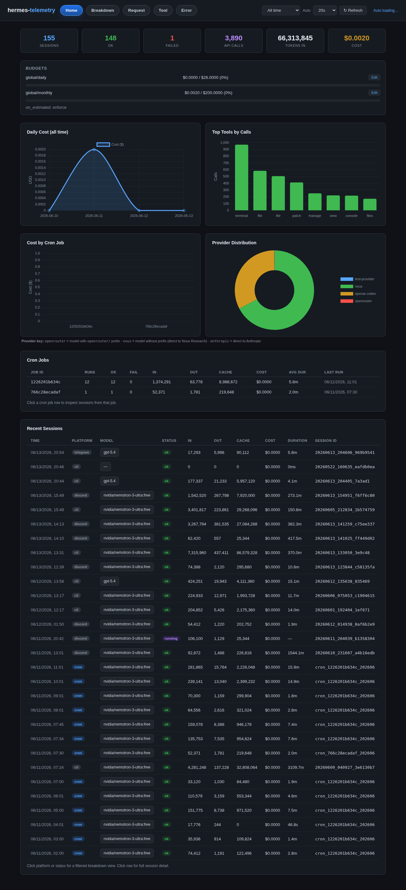
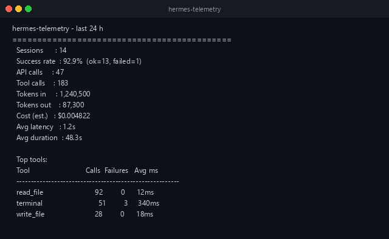
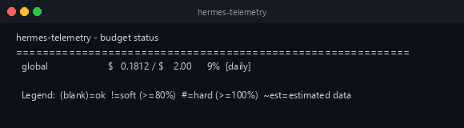
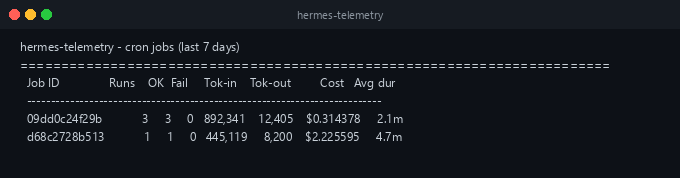
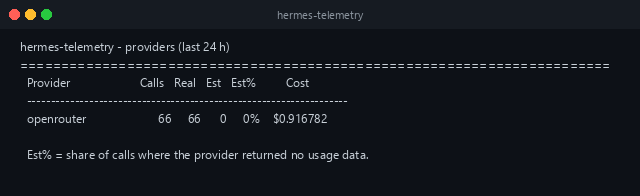

# hermes-telemetry

> *Observability + budget guardrails for [Hermes Agent](https://github.com/NousResearch/hermes-agent)*

A comprehensive telemetry plugin that captures real usage data, enforces budget limits, and provides detailed cost analysis for AI agent operations. Built for the [Hermes Agent Challenge](https://dev.to/devteam/join-the-hermes-agent-challenge-1000-in-prizes-13cd) by [Nadia Ujovich](https://nadiaujovich.dev).


   

---

**Design principle:** observability is invisible to the model. Everything goes through hooks. The only user-facing surface is `/stats` and `/budget`.

---

## Table of Contents

- [Screenshots](#screenshots)
  - [Dashboard (Web UI)](#dashboard-web-ui)
  - [Slash Commands](#slash-commands-1)
- [What It Measures](#what-it-measures)
- [Installation](#installation)
- [Quick Start](#quick-start)
- [Dashboard (Web UI)](#dashboard-web-ui-1)
  - [Auto-Refresh](#auto-refresh)
  - [Features](#features)
- [Slash Commands](#slash-commands-2)
  - [/stats](#stats)
  - [/budget](#budget)
- [Configuration](#configuration)
  - [pricing.yaml](#pricingyaml)
  - [budget.yaml](#budgetyaml)
- [Pricing Auto-Refresh](#pricing-auto-refresh)
  - [How It Works](#how-it-works)
  - [Estimated-Price Models](#estimated-price-models)
  - [CLI Usage](#cli-usage)
- [Architecture](#architecture)
  - [Hook Pipeline](#hook-pipeline)
  - [Database Schema](#database-schema)
  - [Concurrency Model](#concurrency-model)
- [Budget Enforcement](#budget-enforcement)
  - [How It Works](#how-it-works)
  - [Enforcement Levels](#enforcement-levels)
  - [Estimated Data and Budget Degradation](#estimated-data-and-budget-degradation)
- [Provider Probe: Verifying Your Provider](#provider-probe-verifying-your-provider)
- [Proof of Concept](#proof-of-concept)
  - [Setup](#setup)
  - [Pricing Capture](#pricing-capture)
  - [Budget Enforcement Test](#budget-enforcement-test)
  - [Cron Job Cost Comparison](#cron-job-cost-comparison)
  - [Results Summary](#results-summary)
- [Running Tests](#running-tests)
- [Data Location](#data-location)
- [Known Limitations](#known-limitations)
- [Troubleshooting](#troubleshooting)
- [License](#license)
- [Hermes Agent Challenge](#hermes-agent-challenge)

---

## Screenshots

### Dashboard (Web UI)

A standalone HTML dashboard for users who prefer a visual interface over slash commands. Served locally, reads directly from the telemetry SQLite database.



*The dashboard auto-refreshes every 30 seconds. Shows sessions, API calls, tokens, cost, budget status, daily cost trends, top tools, cost by cron job, provider distribution, and recent sessions.*

### Slash Commands

#### `/stats` — Session analytics


#### `/budget` — Current spending vs limits  


#### `/stats cron week` — Cron job cost breakdown


#### `/stats providers` — Real vs estimated usage + estimated-price warning


---

## What It Measures

| Metric | Source | Real or Estimated |
|--------|--------|-------------------|
| Tokens in / out per API call | `post_api_request.usage` | ✅ Real (from provider) |
| Cache read / write tokens | `post_api_request.usage` | ✅ Real (from provider) |
| Reasoning tokens | `post_api_request.usage` | ✅ Real (from provider) |
| API call latency | `post_api_request.api_duration` | ✅ Real (ms) |
| Tool call latency & success/failure | `post_tool_call` | ✅ Real |
| Session / cron job wall time | `started_at` → `ended_at` | ✅ Real |
| Model & provider name | `post_api_request` | ✅ Real |
| Platform (cli / cron / telegram / …) | `on_session_start.platform` | ✅ Real |
| Cron job ID | Parsed from `session_id` | ✅ Real |
| Subagent invocation count | `subagent_stop` hook | ✅ Real (proxy) |
| **Cost (USD)** | Local pricing table × tokens | ⚠️ **Estimated** |
| Tokens when provider returns `usage=None` | Fallback approximation | ⚠️ **Estimated, flagged** |

Cost is always an **estimate** computed locally: a pricing table (USD per 1M tokens) multiplied by the token counts from each API call. The pricing table is refreshed periodically from the OpenRouter public API (`https://openrouter.ai/api/v1/models`, no auth required); this fetch downloads **only** model prices — no user usage data is sent. User overrides in `pricing.yaml` are always preserved over auto-fetched values. When the provider returns no usage data, tokens are estimated from a pre-request approximation + response length and the row is flagged as `estimated=1`, so `/stats` and `/budget` show a `~` prefix and an "estimated data" percentage.

---

## Installation

Hermes plugins are **opt-in** — you must both install and enable the plugin.

### Option A: Install from GitHub

```bash
hermes plugins install nujovich/hermes-telemetry
hermes plugins enable hermes-telemetry
```

### Option B: Manual install

```bash
git clone https://github.com/nujovich/hermes-telemetry ~/.hermes/plugins/hermes-telemetry
hermes plugins enable hermes-telemetry
```

**Important:** restart the Hermes gateway after enabling:

```bash
hermes gateway restart
```

> **Note:** Plugin changes only take effect after a gateway restart. The gateway loads the plugin registry at startup. If you enable a plugin and cron jobs don't appear in `/stats cron week`, this is the most likely cause.

---

## Quick Start

1. Install and enable the plugin (see above)
2. Restart the gateway
3. On first load, the plugin auto-generates `pricing.yaml` and `budget.yaml`
   with sensible defaults (30+ built-in models + OpenRouter fetch, $5/day budget)
4. Run any session, then type `/stats` to see captured data

### Customizing the defaults

```bash
# View what's configured and what options exist
/setup

# Reconfigure pricing (auto-fetch from OpenRouter)
/setup pricing auto

# Reconfigure pricing (built-in defaults only)
/setup pricing minimal

# Reconfigure budget (recommended defaults)
/setup budget default

# Set custom budget
/budget set global daily 10.00
```

That's it. The plugin captures data automatically — no agent action required.

---

## Slash Commands

### `/setup`

```bash
/setup                          → show current status + available options
/setup pricing auto             → auto-generate pricing (built-in + OpenRouter fetch)
/setup pricing minimal          → built-in defaults only (~30 models, no network)
/setup pricing skip             → don't configure pricing
/setup budget default           → recommended global budget ($5/day, $100/month)
/setup budget custom            → set your own limits (shows instructions)
/setup budget skip              → no budgets (costs tracked, no enforcement)
```

The setup wizard runs automatically on first plugin load. It creates `pricing.yaml`
and `budget.yaml` with sensible defaults so you don't have to. You can re-run
`/setup` anytime to reconfigure.

**Pricing auto-fetch:** When you run `/setup pricing auto`, the plugin fetches all
models with fixed pricing from the OpenRouter API (~300+ models) and merges them
with the built-in defaults. Models already in the built-in table (e.g. `claude-opus-4`,
`gpt-4o`, `owl-alpha`) keep their built-in prices. New models from OpenRouter are
added with their API-reported prices.

> **No restart needed:** `/setup pricing auto` (and `pricing minimal`) hot-reload
> the in-process pricing cache after writing `pricing.yaml`, so new prices take
> effect on the very next API call — same pattern as `/budget set`. The 24h
> background auto-refresh does the same when it detects changes. (Editing
> `pricing.yaml` by hand is still picked up on the next gateway restart, since
> nothing signals the running process to reload.)

**Budget defaults:** The recommended budget is `$5.00/day` and `$100.00/month` global.
Adjust anytime with `/budget set global daily <amount>`.

### `/stats`

```
/stats                  → last 24h summary (sessions, tokens, cost, top tools)
/stats today            → same as /stats
/stats week             → last 7 days
/stats month            → last 30 days
/stats cron             → breakdown by cron_job_id (last 7 days)
/stats cron week        → cron breakdown, last 7 days
/stats cron month       → cron breakdown, last 30 days
/stats cron today       → cron breakdown, last 24 hours
/stats providers        → per-provider: real vs estimated calls + cost (last 24h)
/stats providers week   → provider breakdown, last 7 days
/stats models           → per-model breakdown within each provider (last 24h)
/stats models week      → per-model breakdown, last 7 days
/stats models month     → per-model breakdown, last 30 days
/stats raw [N]          → last N raw run records (default 20, max 200)
```

**Example output (`/stats`):**

```
hermes-telemetry — last 24 h
============================================
  Sessions      : 14
  Success rate  : 92.9%  (ok=13, failed=1)
  API calls     : 47
  Tool calls    : 183
  Tokens in     : 1,240,500
  Tokens out    : 87,300
  Cost (est.)   : $0.004822
  Avg latency   : 1.2s
  Avg duration  : 48.3s

  Top tools:
  Tool                            Calls  Failures   Avg ms
  --------------------------------------------------------
  read_file                          92         0      12ms
  terminal                            51         3     340ms
  write_file                         28         0      18ms
```

**Example output (`/stats cron week`):**

```
hermes-telemetry — cron jobs (last 7 days)
========================================================================
  Job ID               Runs    OK  Fail     Tok-in    Tok-out         Cost   Avg dur
  --------------------------------------------------------------------------
  09dd0c24f29b            3     3     0   892,341    12,405    $0.314378     2.1m
  d68c2728b513            1     1     0   445,119     8,200    $2.225595     4.7m
```

**Example output (`/stats providers`):**

```
hermes-telemetry — providers (last 24 h)
========================================================================
  Provider                     Calls   Real   Est   Est%         Cost
  -------------------------------------------------------------------
  openrouter                      66     66      0     0%    $0.916782

  Est% = share of calls where the provider returned no usage data
  (tokens estimated locally).
  If Est% > 0 for your main provider, budget hard-verdicts may be
  degraded to soft under on_estimated.mode: warn_only.
```

> **Note on the provider label:** the provider shown by `/stats providers` is
> whatever the Hermes gateway reports for each API call (`post_api_request`
> hook), stored verbatim and grouped — it is **not** derived from the model
> name. Everything the gateway routes through OpenRouter therefore appears under
> its `openrouter` label regardless of the model's own `google/`, `openai/`,
> `anthropic/`, … prefix. `(unknown)` means the gateway reported no provider.

**Example output (`/stats models`):**

`/stats models` breaks each provider down by model. It's the quickest way to
spot a model billing at `$0.00` — usually a model the gateway records with a
date suffix (e.g. `google/gemini-3-flash-preview-20251217`) whose price entry
in `pricing.yaml` is the date-less key. (As of the latest pricing matcher,
date-less keys cover their dated variants by prefix, so most of these now cost
correctly — this view confirms it.)

```
hermes-telemetry — models (last 24 h)
================================================================================================
  Provider             Model                                           Calls   Real   Est         Cost
  ----------------------------------------------------------------------------------------------
  anthropic            claude-opus-4-8                                    31     31     0    $0.892100
  openrouter           google/gemini-3-flash-preview-20251217             22     22     0    $0.021455
  openrouter           openai/gpt-5.5-20260423                             13     13     0    $0.003217
```

### `/budget`

```
/budget                             → status of every scope (spent / limit / %)
/budget cron                        → per-cron-job budgets, with soft/hard flags
/budget set global daily 5.00       → set or raise a limit (persists + hot-reloads)
/budget set cron_job daily 1.00     → set default per-cron-job limit
/budget set sender daily 2.00       → set default per-sender limit
```

**Example output (`/budget`):**

```
hermes-telemetry — budget status
============================================================
  global                       $   0.1812 / $    2.00      9%  [daily]

  Legend:  (blank)=ok  !=soft (≥80%)  █=hard (≥100%)  ~est=estimated data
```

**Status flags:**

| Flag | Meaning |
|------|---------|
| (blank) | Within budget (`< 80%`) |
| `!` | Soft warning (≥ 80%) — notice injected into conversation |
| `█` | Hard breach (≥ 100%) — tool calls blocked, cron jobs paused |
| `~est` | Verdict based partly on estimated (usage=None) data |

---

## Dashboard (Web UI)

A standalone HTML dashboard for users who prefer a visual interface over slash commands. Zero dependencies — uses only Python stdlib.

### Auto-Refresh

The dashboard auto-refreshes every 30 seconds. No manual reload needed.

### Features

- **Summary cards**: Sessions, OK/failed, API calls, tokens in, cost
- **Budget bar**: Real-time spend vs limit with progress indicator
- **Daily cost chart**: 7-day line chart of spending
- **Top tools chart**: Bar chart of most-used tools
- **Cost by cron job**: Per-job cost breakdown
- **Provider distribution**: Donut chart (nous / openrouter / anthropic)
- **Cron jobs table**: Runs, tokens, cost, avg duration, last run
- **Recent sessions table**: All sessions with platform, model, status, cost
- **Time range selector**: Last 24h / 7 days / 30 days

### Usage

```bash
cd ~/.hermes/plugins/hermes-telemetry/dashboard
python3 serve.py        # serves on http://localhost:8765
python3 serve.py 9090   # custom port
```

Then open `http://localhost:8765` in your browser.

---

## Configuration

Configuration lives in `~/.hermes/telemetry/`:

```
~/.hermes/telemetry/
├── telemetry.db      ← SQLite database (WAL mode)
├── telemetry.log     ← plugin log (errors / debug)
├── pricing.yaml      ← model prices (auto-generated on first load)
└── budget.yaml       ← spend guardrails (auto-generated on first load)
```

Both `pricing.yaml` and `budget.yaml` are auto-generated on first plugin load.
If you delete either file, the wizard will offer to re-create it on the next
gateway restart. You can also re-run `/setup` at any time.

### `pricing.yaml`

Override model prices in USD per 1 million tokens. Without overrides, unknown models log a one-time warning and record cost as `$0.00`.

**Full format:**

```yaml
models:
  # Free model
  "openrouter/owl-alpha":
    input: 0.00
    output: 0.00

  # Paid model with full cache/reasoning split
  "openrouter/anthropic/claude-sonnet-4-6":
    input: 3.00
    output: 15.00
    cache_read: 0.30
    cache_write: 3.75
    reasoning: 15.00

  # Minimal override (cache prices derived from multipliers)
  "openrouter/anthropic/claude-opus-4-7":
    input: 5.00
    output: 25.00

defaults:
  cache_read_multiplier: 0.10   # cache_read = input * 0.10 if not specified
  cache_write_multiplier: 1.25  # cache_write = input * 1.25 if not specified
```

**Matching rules (in order):**

1. Exact match (case-insensitive) against `models:` keys in your YAML
2. Exact match against the built-in pricing table (~35 models)
3. Longest-prefix match across **all** known keys — your YAML models
   (including auto-refreshed OpenRouter keys), the built-in table, **and** the
   curated family-prefix table. The longest matching prefix wins, with the more
   authoritative source preferred on ties (YAML > built-in > family table).
   This is why a date-less key like `google/gemini-3-flash-preview` covers the
   dated variant the gateway actually sends (`google/gemini-3-flash-preview-20251217`),
   and why `claude-sonnet` still matches `claude-sonnet-4-6-future`.
4. Unknown → `$0.00` with a one-time warning in `telemetry.log`

The built-in table covers: Anthropic (Claude 3/4 family), OpenAI (GPT-4o, GPT-4, o1, o3, o4), DeepSeek, Gemini, Llama, and Hermes models. Prices sourced from official provider pages (May 2026).

### `budget.yaml`

Configure spend guardrails. No file → budgets disabled.

```yaml
budgets:
  global:
    daily_usd: 2.00
    monthly_usd: 50.00
  per_cron_job:
    default:
      daily_usd: 1.00
    overrides:
      daily_email_report:
        daily_usd: 3.00
  per_sender:
    default:
      daily_usd: 2.00
    overrides:
      premium_user_123:
        daily_usd: 5.00

thresholds:
  soft_pct: 0.80    # warn at 80% of limit
  hard_pct: 1.00    # enforce at 100%

on_estimated:
  mode: enforce     # warn_only | enforce
```

**Scope resolution:**

| Scope | How spend is calculated |
|-------|------------------------|
| `global` | All sessions + all cron jobs combined |
| `per_cron_job` | Sessions where `cron_job_id` matches (excludes subagent cost) |
| `per_sender` | Sessions from a specific sender (multi-user gateways) |

**Window math:** daily and monthly windows are computed in the user's local timezone. A cron job that runs at 11:59 PM and another at 12:01 AM count against different daily windows.

---

## Pricing Auto-Refresh

The plugin can automatically fetch model pricing from OpenRouter's public API, eliminating the need to manually maintain `pricing.yaml` for hundreds of models.

### How It Works

- **Source**: OpenRouter public API (`https://openrouter.ai/api/v1/models`) — no auth required
- **Frequency**: Once per 24 hours (tracked via sentinel file)
- **Trigger**: Automatically on plugin load (gateway startup), or manually via CLI
- **Merge strategy**:
  - User overrides in `pricing.yaml` are **always preserved** — manual entries take priority over auto-fetched ones
  - New models from the API are added automatically
  - Previously auto-fetched models are updated when prices change
  - Models are tagged with `_auto: true` and `_source: openrouter` for traceability

### Estimated-Price Models

Some OpenRouter models have no fixed pricing (e.g. `auto` routing, experimental models). These are represented with negative prices in the API.

The plugin handles these safely:

- Prices are normalized to `$0.00` (they don't inflate cost calculations)
- Flagged with `_estimated_price: true` in `pricing.yaml`
- The budget engine detects when spend uses these models

**Budget degradation logic:**

| Condition | Effect |
|-----------|--------|
| `on_estimated.mode: warn_only` (default) | If >0% of calls use estimated-price models, **hard verdicts are degraded to soft** — the user gets a warning but tools aren't blocked |
| `on_estimated.mode: enforce` | Hard verdicts take effect regardless |

This ensures budgets are reliable even when some models lack fixed pricing.

### CLI Usage

```bash
# Dry run — see what would change
python -m hermes_telemetry.pricing_refresh --check

# Apply changes
python -m hermes_telemetry.pricing_refresh

# Verbose output
python -m hermes_telemetry.pricing_refresh --verbose
```

**Example output:**

```
INFO OpenRouterSource: fetched 320 models
Updated 3 model(s):

  ~ stepfun/step-3.7-flash  (openrouter)
      input: 0.9999 → 0.2000
      output: 9.9999 → 1.1500

  + anthropic/claude-opus-4.8  (openrouter)
      input=5.0000 output=25.0000

  ⚠  Model(s) with estimated pricing: openrouter/auto, openrouter/bodybuilder, openrouter/pareto-code
```

### Extending with New Sources

Add new pricing providers by subclassing `PricingSource`:

```python
from hermes_telemetry.pricing_refresh import PricingSource, register_source

class AnthropicSource(PricingSource):
    name = "anthropic"

    def fetch(self) -> dict[str, dict]:
        # Fetch from Anthropic's pricing page or API
        ...

register_source(AnthropicSource)
```

Sources are registered in `pricing_refresh.py` and fetched in parallel on each refresh cycle.

---

## Architecture

### Hook Plugin

The plugin registers 10 hooks (out of 16 available in Hermes) plus 2 slash commands:

```
Hook                      Purpose
─────────────────────────────────────────────────────────────
on_session_start          Create run row, extract cron_job_id
pre_api_request           Stash approx_input_tokens for fallback
post_api_request          PRIMARY: record tokens, cost, latency
post_tool_call            Record tool name, success, duration
post_llm_call             Refresh session end timestamp
subagent_stop             Record delegate_task proxy on parent
on_session_end            Set final status (ok/error/interrupted)
on_session_finalize       Safety net: ensure run is closed
pre_llm_call              Soft budget alerts + capture sender_id
pre_tool_call             Hard budget enforcement (tool-gate)
```

**Why `post_api_request` is the primary hook for tokens:** The Hermes conversation loop can make multiple API calls per turn (retries, reasoning models, tool calls). Only `post_api_request` carries the canonical `usage` dict with token counts and cost data. `pre_llm_call` fires once per turn with no token data. `post_llm_call` fires after the tool loop with no token data.

**Cron job identification:** There is no `cron_job_id` in any hook. The plugin extracts it from the `session_id`, which follows the format `cron_{job_id}_{YYYYMMDD_HHMMSS}` (confirmed in Hermes source). An anchored regex handles job IDs that contain underscores.

### Database Schema

SQLite with WAL mode, per-thread connections, schema v3:

**`runs`** — one row per session (CLI session or cron job execution):

| Column | Description |
|--------|-------------|
| `session_id` | Primary key (`{YYYYMMDD_HHMMSS}_{uuid6}` for CLI, `cron_{job_id}_{ts}` for cron) |
| `platform` | `cli`, `cron`, `telegram`, `discord`, etc. |
| `cron_job_id` | Extracted from session_id when platform=cron |
| `model` | Model name (updated from last API call) |
| `provider` | Provider name (e.g. `openrouter`, `anthropic`) |
| `started_at` / `ended_at` | ISO-8601 UTC timestamps |
| `status` | `running`, `ok`, `error`, `interrupted` |
| `tokens_in` / `tokens_out` | Accumulated across all API calls in the session |
| `cost_usd` | Accumulated estimated cost |
| `duration_ms` | Wall time (ms) via `julianday()` |
| `api_calls` / `tool_calls` | Counters |
| `parent_session_id` | Reserved for future parent-child linking (not populated in v0.2) |
| `estimated_llm_calls` | Count of calls where provider returned `usage=None` |
| `sender_id` | For per-sender budgets (set via `pre_llm_call`) |

**`llm_calls`** — one row per individual API call:

All of `runs` token/cost columns, plus `cache_read_tokens`, `cache_write_tokens`, `reasoning_tokens`, `estimated` (boolean).

**`tool_calls`** — one row per tool execution:

`session_id`, `ts`, `tool_name`, `ok` (boolean), `latency_ms`.

**`budget_alerts`** — anti-spam ledger:

`scope`, `scope_id`, `window`, `period_key`, `level`, `fired_at`, `spent_usd`, `limit_usd`. Unique constraint prevents duplicate alerts.

### Concurrency Model

Cron jobs run in a `ThreadPoolExecutor` (Hermes `cron/scheduler.py`). Multiple jobs can write to the DB simultaneously from different threads.

**Design:** per-thread SQLite connections via `threading.local()`. Each thread opens its own connection to the same WAL-mode DB file. A serializable `_schema_lock` protects DDL migrations on first connect (WAL mode switch requires a brief lock that `busy_timeout` alone doesn't handle).

`busy_timeout=5000` ensures write collisions retry for 5 seconds before raising. `synchronous=NORMAL` balances durability with write performance (safe for WAL mode).

---

## Budget Enforcement

### How It Works

Every time the agent is about to do work, the plugin checks:

1. **`pre_llm_call`** (fires once per turn): evaluates all applicable budget scopes. If any has a `soft` or `hard` verdict that hasn't been alerted yet this window, injects a one-time notice into the conversation context (anti-spam via `budget_alerts` table). Captures `sender_id`.

2. **`pre_tool_call`** (fires before every tool): re-evaluates budgets. If any scope is in `hard` breach, returns `{"action":"block","message":...}` which aborts the tool call.

3. **For cron jobs with `hard` breach:** additionally calls `cron.jobs.pause_job` to pause future runs.

### Enforcement Levels

Hermes does **not** expose a way to abort an in-flight model call from a plugin. `pre_llm_call` / `pre_api_request` returns can't cancel a call. So enforcement is honest about its reach:

| Level | Trigger | Effect | Repeat? |
|-------|---------|--------|---------|
| **Soft** (≥ `soft_pct`) | Spend reaches 80% of limit (configurable) | One-time notice injected into conversation | Once per window per scope |
| **Hard** (≥ `hard_pct`) | Spend reaches 100% of limit | Every subsequent tool call is blocked | Every tool call until window resets |
| **Cron pause** | Any hard `cron_job` verdict | Job is paused for future runs | Once per window per scope |

The model response already in flight still completes and is billed. What's prevented is *further* tool-driven work.

### Estimated Data and Budget Degradation

When the provider returns `usage=None`, the plugin estimates tokens and flags the row as `estimated=1`. Since these estimates may be inaccurate, the budget engine offers a safety valve:

**`on_estimated.mode: warn_only` (default):** If a hard verdict rests partly on estimated rows, it is **degraded to soft** — the user gets a warning but tools aren't blocked. Rationale: a budget built on estimates shouldn't hard-stop work.

**`on_estimated.mode: enforce`:** Hard verdicts take effect regardless of estimate quality. Use this when you trust your provider's usage data (Est% = 0) or when estimates are acceptable.

The `/stats providers` command shows the `Est%` column so you can see at a glance whether your provider returns real usage data.

**Estimated-price models:** Some models (e.g. OpenRouter `auto` routing) have no fixed pricing. These are flagged with `_estimated_price: true` in `pricing.yaml` and normalized to `$0.00`. If >0% of calls use these models, budget hard-verdicts are also degraded to soft under `warn_only` mode. See [Pricing Auto-Refresh](#pricing-auto-refresh) for details.

---

## Provider Probe: Verifying Your Provider Returns Real Usage

Run this **once** after enabling the plugin:

1. Run one short session (any minimal task works)
2. Execute `/stats providers`
3. Look at the `Est%` column for your provider:
   - **`0%`** → provider returns real usage data. Budget verdicts are based on real numbers. Set `on_estimated.mode: enforce` for strict enforcement. ✅
   - **`> 0%`** → provider omits usage in some responses. Those calls are estimated and flagged. Budget hard-verdicts will be degraded to soft under `warn_only`. The `telemetry.log` will have a **one-time WARNING** per provider. ⚠️

---

## Proof of Concept

The following PoC was executed live to validate the plugin end-to-end.

### Setup

- **Hermes gateway** running on Linux (WSL), model `openrouter/owl-alpha` (free tier)
- **Plugin:** hermes-telemetry v0.2.0, loaded in gateway process
- **DB:** `/home/nujovich/.hermes/telemetry/telemetry.db` (schema v3, WAL mode)
- **6 cron jobs** configured, 2 used for this PoC

### Initial Configuration

On first load, the plugin auto-generated `pricing.yaml` with 30+ built-in models
(including `owl-alpha` for Nous Portal and `openrouter/*` models) and `budget.yaml`
with the default `$5/day, $100/month` global budget. No manual YAML editing needed.

Set `on_estimated.mode: enforce` for deterministic enforcement.

### Budget Enforcement Test

**Step 1 — Trigger a hard breach:**

- Budget: `global.daily_usd: 0.001` ($0.001/day)
- Ran MCP Lead Gen job (model: `claude-sonnet-4-6`, ~$3/$15 per 1M)
- Result: job spent $0.1812 on first run → **18,120% of daily limit** → █ hard breach → **job auto-paused**

```
█ global    $0.1812 / $0.00    18120%  [daily]
                         ↑ (0.001 rounded to 0.00 in display)
```

**Step 2 — Raise budget and resume:**

```
/budget set global daily 2.00
```

This hot-reloads the budget config (value was previously cached at $0.001 in memory — edits to `budget.yaml` alone don't take effect without `/budget set` or gateway restart).

Result after `/budget set`:

```
  global    $0.1812 / $2.00    9%  [daily]
```

**Step 3 — Verify job runs normally:**

- MCP Lead Gen re-ran successfully under the $2.00 daily budget
- Second run confirmed: `state: scheduled`, `paused_at: null`

### Cron Job Cost Comparison

Poisoned two jobs with different priced models:

| Job | Model | Price (input/output) |
|-----|-------|---------------------|
| MCP Lead Gen | `claude-sonnet-4-6` | $3.00 / $15.00 per 1M |
| Marketing Highlights | `claude-opus-4-7` | $5.00 / $25.00 per 1M |
| Base sessions (CLI) | `owl-alpha` | $0.00 / $0.00 (free) |

**Results from SQLite (`/stats` after all runs):**

- **CLI sessions** (owl-alpha, free): ~1M tokens in → **$0.00**
- **MCP Lead Gen** (claude-sonnet-4-6): ~892K tokens in → **$0.314**
- **Marketing Highlights** (claude-opus-4-7): ~445K tokens in → **~$2.23** (opus is ~5-8x more expensive per token)

This demonstrates the core value proposition: **you can see exactly how much each cron job costs and compare models.**

### Results Summary

| Component | Status |
||-----------|--------|
|| Token capture from provider | ✅ Real usage (`estimated=0`) |
|| Cost estimation with pricing table | ✅ Accurate to pricing YAML |
|| Cron job session tracking | ✅ Captured via `session_id` regex |
|| Budget soft alerts | ✅ One-time context injection |
|| Budget hard enforcement | ✅ Paused job at $0.001/day |
|| Budget hot-reload via `/budget set` | ✅ Cache cleared, new limit active |
|| Multi-model cost comparison | ✅ Sonnet vs Opus vs Free |
|| Pricing auto-refresh (OpenRouter API) | ✅ 320 models fetched, manual overrides preserved |
|| Estimated-price model handling | ✅ Negative prices → $0.00, budget degradation |
|| Dashboard (HTML, auto-refresh 30s) | ✅ Charts, tables, budget bar, provider distribution |
|| 130 tests pass | ✅ |

---

## Running Tests

```bash
cd hermes-telemetry
pip install pytest pyyaml
pytest tests/ -v
```

**Test suite (130 tests):**

| File | Tests | Coverage |
|------|-------|----------|
| `test_db.py` | 24 | Schema v1→v3 migrations, CRUD, aggregations, concurrent WAL writes (10 threads × 5 writes) |
| `test_pricing.py` | 27 | Cache/reasoning split, no double-counting of `prompt_tokens`, YAML overrides, prefix matching (incl. date-less keys covering dated variants), unknown model handling |
| `test_pricing_hot_reload.py` | 3 | `/setup pricing auto`/`minimal` hot-reload the in-process pricing cache — new prices live without a gateway restart |
| `test_init.py` | 9 | Cron session ID regex, tool success/failure parsing |
| `test_budget.py` | 20 | ok/soft/hard verdicts, estimated-to-soft degradation, anti-spam ledger, cron pause, per-scope routing, `/budget set` hot-reload |
| `test_subagent_reconciliation.py` | 4 | Parent + child hook sequence, token reconciliation, no double-counting |
| `test_stats_providers.py` | 14 | Real vs estimated per provider, `/stats providers` output format, Nous warning dedup |
| `test_stats_models.py` | 8 | Per-model aggregation within each provider, ordering, `/stats models` output format |
| `test_setup.py` | 21 | Setup wizard: auto/minimal/skip pricing, default/custom/skip budget, command handler, idempotency, owl-alpha in defaults |

No live Hermes is required — all tests are self-contained with in-memory SQLite.

---

## Data Location

```
~/.hermes/telemetry/
├── telemetry.db        ← SQLite (WAL mode, ~70KB base + growth)
├── telemetry.log       ← Plugin log (errors, debug, one-time warnings)
├── pricing.yaml        ← Your model price overrides
└── budget.yaml         ← Your spend guardrails
```

The DB grows over time. For high-frequency cron jobs, consider periodic cleanup of old rows (not yet automated — see [Known Limitations](#known-limitations)).

---

## Known Limitations

**Enforcement gaps:**

- **No true mid-call abort.** `pre_llm_call` / `pre_api_request` cannot cancel an
  in-flight model call. The response already generating will complete and be billed.
  The tool-gate (`pre_tool_call`) stops *subsequent* work at the next tool boundary.
- **Runaway text-only sessions.** A session that generates text without calling any
  tools never hits the tool-gate. Budget hard limits won't trigger until the next
  tool call — which may never come.
- **Estimated-price models bypass hard limits.** Models with no fixed pricing on
  OpenRouter (e.g. `auto` routing, experimental models) are flagged
  `_estimated_price: true` and recorded as `$0.00`. If >0% of calls use these
  models, hard budget verdicts degrade to soft under `on_estimated.mode: warn_only`
  (the default). Set `mode: enforce` to override this if you accept the risk.

**Subagent attribution:**

- Child agents (`delegate_task`) run as their own sessions. Their tokens are captured
  independently and included in **global** totals — but only if the child agent also
  has the plugin loaded. If the child runs without it, those tokens are silently
  undercounted.
- There is no parent→child link in any hook, so `per_cron_job` budgets **exclude**
  subagent cost. Use the `global` budget scope to cap total spend including
  delegated work.

**Pricing coverage:**

- The built-in pricing table covers ~30 major models (Anthropic, OpenAI, DeepSeek,
  Gemini, Meta, Nous Research including `owl-alpha`).
- On first load (and every 24h), the plugin auto-fetches additional models from the
  **OpenRouter** public API. User overrides in `pricing.yaml` are always preserved.
- Models routed **through OpenRouter** are covered by the auto-refresh. Models accessed
  **directly** through other providers (e.g. Gemini direct via Google AI Studio,
  Anthropic direct, OpenAI direct) are **not** auto-refreshed — they rely on the
  built-in table or manual overrides in `pricing.yaml`.
- Any model not found in either the built-in table or the auto-fetched data falls
  back to `$0.00` with a one-time warning in `telemetry.log`.

**Dashboard:**

- The web dashboard (`serve.py`) is read-only — it visualizes data but cannot
  modify budgets or trigger pricing refreshes. Use `/budget set` or the CLI for
  those operations.
- `serve.py` has no authentication. Do not expose it on a public or shared network
  interface without adding your own auth layer.

**DB retention:**

- `telemetry.db` grows without bound. No automatic purge of old rows. For
  high-frequency cron jobs with >100K rows, consider periodic manual cleanup
  (not yet automated).

**Gateway restart required:**

- Enabling or updating the plugin takes effect only after a gateway restart. Cron
  runs that started before the restart won't have telemetry data.
---

## Troubleshooting

**`/stats cron week` shows "No cron runs in the last 7 days":**

The gateway loaded before the plugin was enabled. Restart the gateway:
```bash
hermes gateway restart
```
Then re-run a cron job.

**`/budget` shows `$0.00` as the limit:**

The limit is cached in memory at gateway start. If you edited `budget.yaml` directly, the cache is stale. Use `/budget set global daily <amount>` to hot-reload, or restart the gateway.

**Cost is $0.00 for all sessions:**

Your model isn't in the pricing table. The plugin auto-generates `pricing.yaml`
on first load with 30+ built-in models plus an auto-fetch from the **OpenRouter**
public API. If you're using a model that's not covered by either:

```bash
# Re-run the auto-fetch to pick up the latest OpenRouter models
/setup pricing auto

# Or manually add your model to ~/.hermes/telemetry/pricing.yaml
```

Models accessed directly (not through OpenRouter) that aren't in the built-in
table need manual entries — the auto-refresh only covers OpenRouter-routed models.

**Provider Est% > 0:**

Your provider returns `usage=None` for some/all calls. Tokens are estimated. Check `/stats providers` to see which providers are affected. If Est% is 100% for your main provider, all spend is estimated and budget hard-verdicts degrade to soft under `warn_only` mode.

**Plugin not loading at all:**

Check `telemetry.log` for errors. Common causes:
- Missing `pyyaml` in the gateway's venv: `pip install pyyaml`
- Plugin not in `plugins.enabled` in config.yaml
- Syntax error in `pricing.yaml` or `budget.yaml`

---

## License

MIT — see [LICENSE](LICENSE).

---

## Hermes Agent Challenge

This plugin was built for the [**Hermes Agent Challenge**](https://dev.to/devteam/join-the-hermes-agent-challenge-1000-in-prizes-13cd) — a $1,000 competition to build the most useful Hermes Agent plugins and extensions.

**🔗 Challenge Entry:** [hermes-telemetry on dev.to](https://dev.to/devteam/join-the-hermes-agent-challenge-1000-in-prizes-13cd)

**🛠️ Built by:** [Nadia Ujovich](https://github.com/nujovich)

**💡 Why this plugin:** Every AI system needs observability and cost control. This plugin gives Hermes Agent users the visibility to optimize their workflows and the guardrails to prevent bill shock — essential for production deployments and automated cron jobs.

---

*Made with ☕ for the Hermes Agent ecosystem*
