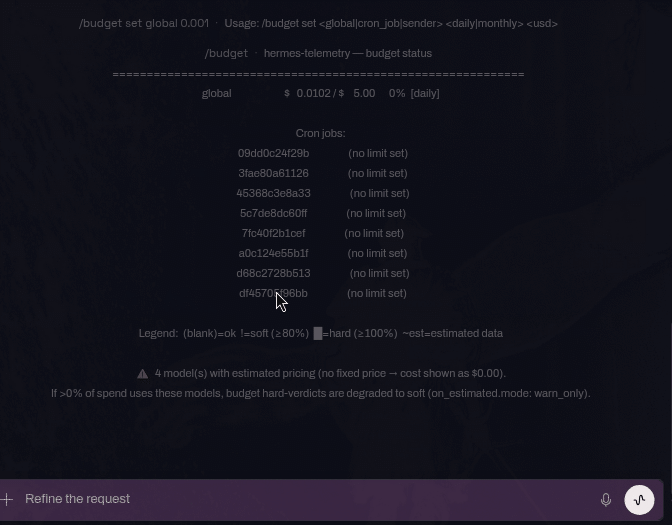
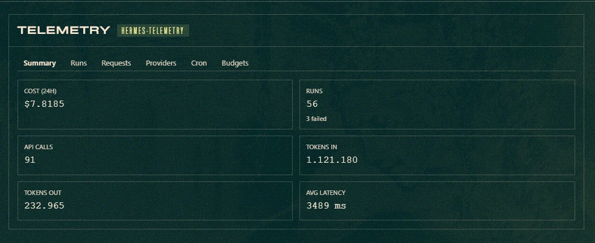
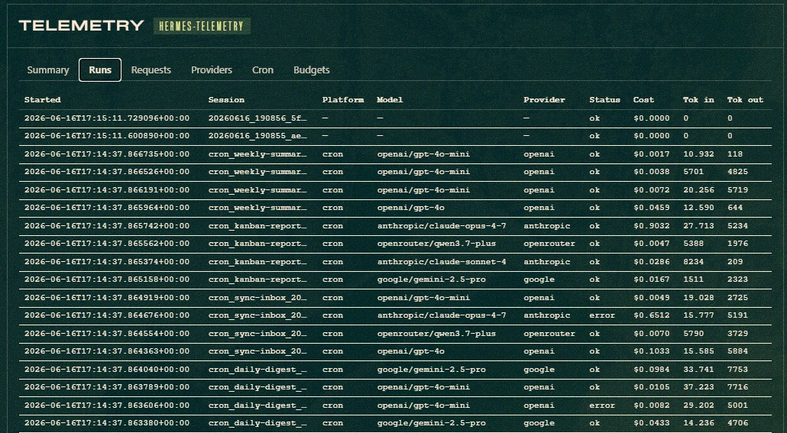
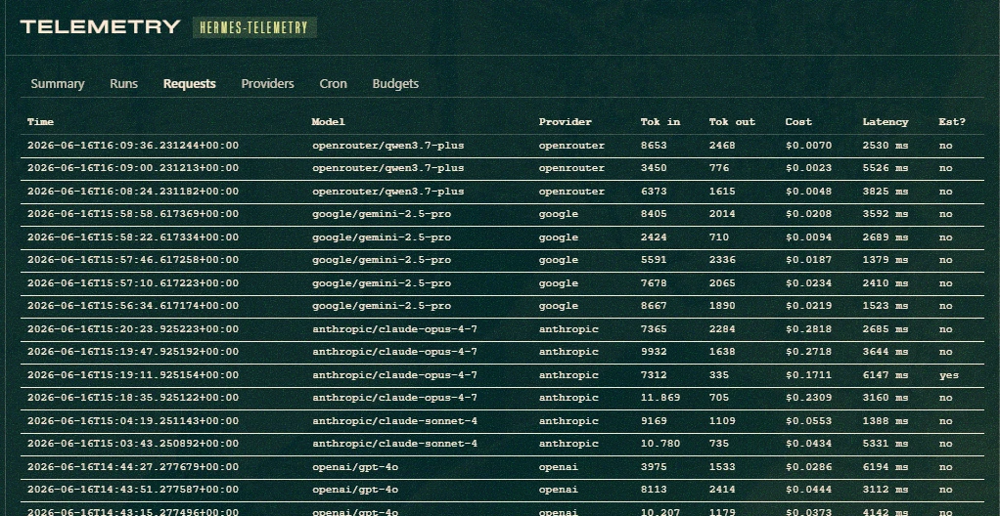
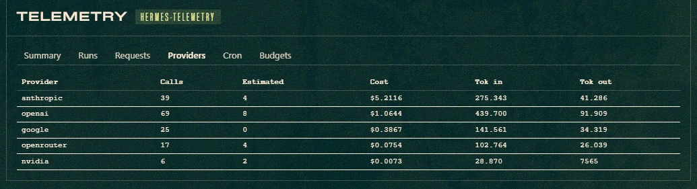
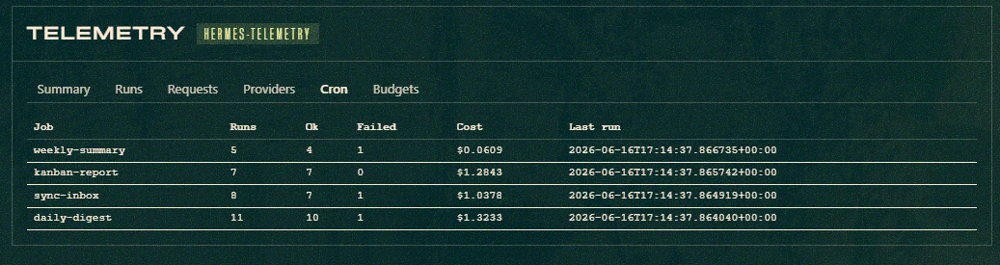
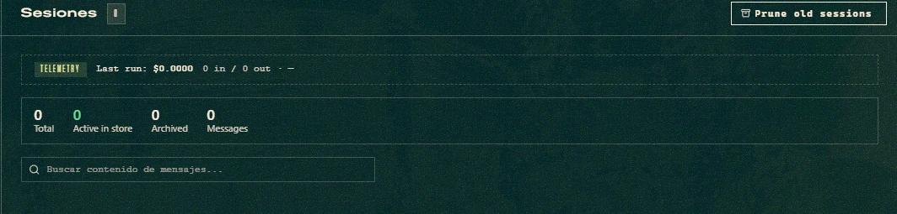
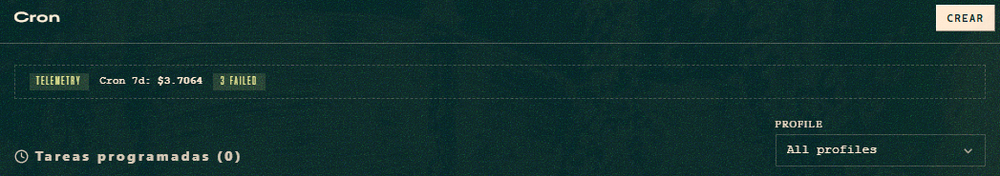

# hermes-telemetry ☤

> *Observability + budget guardrails for [Hermes Agent](https://github.com/NousResearch/hermes-agent)*

**Budget enforcement + observability for Hermes Agent. The only plugin that can stop a run before it overspends.**

A comprehensive telemetry plugin that captures real usage data, enforces budget limits, and provides detailed cost analysis for AI agent operations. Built for the [Hermes Agent Challenge](https://dev.to/devteam/join-the-hermes-agent-challenge-1000-in-prizes-13cd) by [Nadia Ujovich](https://nadiaujovich.dev).

**The differentiator: it can _stop_ work that's about to overspend — not just report it after the fact.** Set a daily cap below current spend, and the next cron run is blocked by the budget:



*`/budget set global daily 0.001` writes the cap to `budget.yaml`; current spend ($0.0102) already exceeds it, so `/budget` re-renders at 1020% `[daily]` — a hard breach — and the next marketing cron run is blocked by the budget.*

[](https://raw.githubusercontent.com/NousResearch/hermes-agent/HEAD/assets/banner.png)

[](https://camo.githubusercontent.com/08cef40a9105b6526ca22088bc514fbfdbc9aac1ddbf8d4e6c750e3a88a44dca/68747470733a2f2f696d672e736869656c64732e696f2f62616467652f4c6963656e73652d4d49542d626c75652e737667) [](https://img.shields.io/badge/Tests-263%20passing-green.svg) [](https://img.shields.io/badge/Providers-OpenRouter-orange.svg) [](https://camo.githubusercontent.com/d0c993fdf35127e435629279025d4b1892e351f5e04ce1547329686aa4223366/68747470733a2f2f696d672e736869656c64732e696f2f62616467652f4865726d65732532304167656e742d4368616c6c656e6765253230456e7472792d707572706c652e737667)

-----

Hermes Agent runs autonomously — across sessions, platforms, and cron jobs — which 
means it can keep spending even when you're not watching.  
**hermes-telemetry lives inside the runtime** and enforces hard budget limits before 
the next LLM call is made.

> This plugin addresses [NousResearch/hermes-agent#6642](https://github.com/NousResearch/hermes-agent/issues/6642) — 
> the open feature request for a first-class telemetry and budget subsystem for Hermes Agent.


```
Your Hermes session
  ↓ every API call
hermes-telemetry (native plugin)
  → tracks tokens + cost in real time
  → enforces budget limits mid-session
  → logs to SQLite with WAL mode
  → syncs OpenRouter pricing automatically
  ↓ if budget OK
LLM provider
```

> **Not a log reader.** TokenTelemetry and similar tools read what already happened.
> hermes-telemetry hooks into the Hermes runtime and can *stop* what’s about to happen.

-----

**Design principle:** observability is invisible to the model. Everything goes through hooks. The only user-facing surface is `/stats` and `/budget`.

-----

> ### ℹ️ Free Nemotron Ultra before June 18, 2026 — no action needed
>
> The `nvidia/nemotron-3-ultra:free` promo **ends June 18, 2026**, after which the
> model bills as `nvidia/nemotron-3-ultra` (and the OpenRouter long form
> `nvidia/nemotron-3-ultra-550b-a55b`). You no longer need to declare anything in
> `pricing.yaml`: **any model id ending in `:free` resolves to `$0` automatically**
> (the OpenRouter free-tier convention) and is recorded as known-free, with no
> estimated-price warning. This covers every form the gateway might send —
> `nvidia/nemotron-3-ultra:free` and `nvidia/nemotron-3-ultra-550b-a55b:free`
> alike.
>
> When the promo ends and the `:free` suffix is dropped, the model starts
> incurring cost and hermes-telemetry detects the free→paid jump — even though the
> id changes — and warns you in-context. (Pricing details: [`pricing.yaml`](#pricingyaml).)
>
> You may still pin an explicit price for a `:free` id if you ever need to (an
> explicit `pricing.yaml` entry overrides the automatic `$0`):
>
> ```yaml
> models:
>   nvidia/nemotron-3-ultra:free:
>     input: 0.0
>     output: 0.0
>     _subscription: true
> ```

-----

## Table of Contents

- [Screenshots](#screenshots)
  - [Dashboard (Web UI)](#dashboard-web-ui)
  - [Slash Commands](#slash-commands-1)
- [What It Measures](#what-it-measures)
- [Installation](#installation)
- [Quick Start](#quick-start)
- [Standalone CLI](#standalone-cli)
- [Setup Wizard](#setup-wizard)
- [Dashboard (Web UI)](#dashboard-web-ui-1)
  - [Auto-Refresh](#auto-refresh)
  - [Features](#features)
- [Slash Commands](#slash-commands-2)
  - [/stats](#stats)
  - [/budget](#budget)
- [Configuration](#configuration)
  - [pricing.yaml](#pricingyaml)
  - [budget.yaml](#budgetyaml)
- [Pricing Auto-Refresh](#pricing-auto-refresh)
  - [How It Works](#how-it-works)
  - [Estimated-Price Models](#estimated-price-models)
  - [CLI Usage](#cli-usage)
- [Architecture](#architecture)
  - [Hook Pipeline](#hook-pipeline)
  - [Database Schema](#database-schema)
  - [Concurrency Model](#concurrency-model)
- [Budget Enforcement](#budget-enforcement)
  - [How It Works](#how-it-works)
  - [Enforcement Levels](#enforcement-levels)
  - [Estimated Data and Budget Degradation](#estimated-data-and-budget-degradation)
- [Provider Probe: Verifying Your Provider](#provider-probe-verifying-your-provider)
- [Proof of Concept](#proof-of-concept)
  - [Setup](#setup)
  - [Pricing Capture](#pricing-capture)
  - [Budget Enforcement Test](#budget-enforcement-test)
  - [Cron Job Cost Comparison](#cron-job-cost-comparison)
  - [Results Summary](#results-summary)
- [Comparison](#comparison)
- [Running Tests](#running-tests)
- [Data Location](#data-location)
- [Known Limitations](#known-limitations)
- [Troubleshooting](#troubleshooting)
- [License](#license)
- [Hermes Agent Challenge](#hermes-agent-challenge)

-----

## Screenshots

### Dashboard (Web UI)

A standalone HTML dashboard for users who prefer a visual interface over slash commands. Served locally, reads directly from the telemetry SQLite database.

[](https://github.com/nujovich/hermes-telemetry/blob/main/docs/screenshots/dashboard-overview.png)

*Current dashboard home view with the tabbed layout (`Home / Breakdown / Request / Tool / Error`), header auto-refresh controls, budget windows rendered in the viewer's local timezone, and the refreshed recent-session tables.*

### Slash Commands

#### `/stats` — Session analytics

[](https://github.com/nujovich/hermes-telemetry/blob/main/docs/screenshots/stats-output.png)

#### `/budget` — Current spending vs limits

[](https://github.com/nujovich/hermes-telemetry/blob/main/docs/screenshots/budget-output.png)

#### `/stats cron week` — Cron job cost breakdown

[](https://github.com/nujovich/hermes-telemetry/blob/main/docs/screenshots/cron-output.png)

#### `/stats providers` — Real vs estimated usage + estimated-price warning

[](https://github.com/nujovich/hermes-telemetry/blob/main/docs/screenshots/providers-output.png)

-----

## What It Measures

|Metric                                   |Source                         |Real or Estimated       |
|-----------------------------------------|-------------------------------|------------------------|
|Tokens in / out per API call             |`post_api_request.usage`       |✅ Real (from provider)  |
|Cache read / write tokens                |`post_api_request.usage`       |✅ Real (from provider)  |
|Reasoning tokens                         |`post_api_request.usage`       |✅ Real (from provider)  |
|API call latency                         |`post_api_request.api_duration`|✅ Real (ms)             |
|Tool call latency & success/failure      |`post_tool_call`               |✅ Real                  |
|Session / cron job wall time             |`started_at` → `ended_at`      |✅ Real                  |
|Model & provider name                    |`post_api_request`             |✅ Real                  |
|Platform (cli / cron / telegram / …)     |`on_session_start.platform`    |✅ Real                  |
|Cron job ID                              |Parsed from `session_id`       |✅ Real                  |
|Subagent invocation count                |`subagent_stop` hook           |✅ Real (proxy)          |
|Free→paid model transition alert         |`known_free_models` table + `post_api_request` cost check|✅ Real                  |
|**Cost (USD)**                           |Local pricing table × tokens   |⚠️ **Estimated**         |
|Tokens when provider returns `usage=None`|Fallback approximation         |⚠️ **Estimated, flagged**|

Cost is always an **estimate** computed from a locally-maintained pricing table. No external pricing API is called. When the provider returns no usage data, tokens are estimated from a pre-request approximation + response length and the row is flagged as `estimated=1`, so `/stats` and `/budget` show a `~` prefix and an “estimated data” percentage.

-----

## Installation

Hermes plugins are **opt-in** — you must both install and enable the plugin.

### Option A: Install from GitHub

```
hermes plugins install nujovich/hermes-telemetry
hermes plugins enable hermes-telemetry
```

To use `hermes-telemetry` from the command line outside of sessions (one-time setup):

```bash
chmod +x ~/.hermes/plugins/hermes-telemetry/hermes-telemetry
ln -s ~/.hermes/plugins/hermes-telemetry/hermes-telemetry ~/.local/bin/hermes-telemetry
```

Future `git pull` updates the CLI automatically — no re-linking needed.

### Option B: Manual install

```
git clone https://github.com/nujovich/hermes-telemetry ~/.hermes/plugins/hermes-telemetry
hermes plugins enable hermes-telemetry
```

To use `hermes-telemetry` from the command line outside of sessions (one-time setup):

```bash
chmod +x ~/.hermes/plugins/hermes-telemetry/hermes-telemetry
ln -s ~/.hermes/plugins/hermes-telemetry/hermes-telemetry ~/.local/bin/hermes-telemetry
```

Future `git pull` updates the CLI automatically — no re-linking needed.

**Important:** restart the Hermes gateway after enabling:

```
hermes gateway restart
```

> **Note:** Plugin changes only take effect after a gateway restart. The gateway loads the plugin registry at startup. If you enable a plugin and cron jobs don’t appear in `/stats cron week`, this is the most likely cause.

-----

## Hermes Dashboard Plugin

`hermes-telemetry` also ships as a **Hermes dashboard plugin**. When the Hermes web dashboard is running, it auto-discovers the plugin from this same install path — no extra steps. You get a dedicated **Telemetry** tab plus widgets injected into the built-in pages.

### Screenshots

**Dedicated Telemetry tab — Summary**

[](docs/plugin/01-summary.png)

*The default sub-tab. Six stat cards summarise the last 24h: cost, total runs (with failed split), API calls, tokens in / out, and average latency. All values come from `/api/plugins/hermes-telemetry/summary`.*

**Runs**

[](docs/plugin/02-runs.png)

*One row per session in the last 7 days: started_at, session id, platform (cli / cron / telegram), model, provider, status, cost and token counts. Cron sessions surface as `cron_<job>_…` and any `error` status row appears with its status column.*

**Requests**

[](docs/plugin/03-requests.png)

*Per-API-call detail (`/api/plugins/hermes-telemetry/requests`): timestamp, model, provider, tokens, cost, latency, and an `Est?` column that flags rows recorded with `estimated=1` (provider returned no usage info — counts came from the fallback estimator).*

**Providers**

[](docs/plugin/04-providers.png)

*Aggregated by provider: total calls, how many of those were estimated, total cost, and tokens in / out. Useful for spotting a provider whose share of the bill is disproportionate to its share of traffic.*

**Cron**

[](docs/plugin/05-cron-tab.png)

*The `Cron` sub-tab aggregates runs by `cron_job_id`: total runs, ok / failed split, cost, and last execution. Built from `/api/plugins/hermes-telemetry/cron`.*

**Budgets — soft / hard semáforo**

[](docs/plugin/06-budgets-tab.png)

*Global daily and monthly budgets read live from `budget.yaml`. The HARD badge fires when spend exceeds the hard cap (`$7.82 / $5.00 = 156.4%` here); soft and ok states use distinct badge variants.*

**Slot: `sessions:top` (injected into `/sessions`)**

[](docs/plugin/07-slot-sessions-top.png)

*A pinned card at the top of the Sessions page surfaces the most recent run with real activity — cost, tokens in / out, and the model used.*

**Slot: `cron:top` (injected into `/cron`)**

[](docs/plugin/08-slot-cron-top.png)

*Aggregate 7-day cron cost plus a destructive `N FAILED` badge when any job failed in the window.*

**Slot: `header-right` (injected into the dashboard header)**

[](docs/plugin/09-slot-header-right.png)

*Compact 24h spend + percentage against the global daily cap. Badge turns `destructive` on hard breach.*

> *Tip:* run [`tools/seed_demo_data.py`](tools/seed_demo_data.py) against an isolated `HERMES_HOME` to populate the dashboard with realistic demo data before taking your own screenshots.

### What you get

- A `/telemetry` tab with sub-tabs: **Summary**, **Runs**, **Requests**, **Providers**, **Cron**, **Budgets**.
- Slot widgets on the existing dashboard pages:
  - `sessions:top` — last run summary (cost · tokens · model).
  - `cron:top` — 7-day cron cost and failure badge.
  - `header-right` — 24h spend + global daily budget level (semáforo).
  - `analytics:bottom` — daily cost chart (Chart.js loaded from CDN).

### How discovery works

When the Hermes dashboard process starts, it scans for `~/.hermes/plugins/<name>/dashboard/manifest.json` (verified against [`hermes_cli/web_server.py`](https://github.com/NousResearch/hermes-agent/blob/main/hermes_cli/web_server.py)). Because the standalone dashboard at `dashboard/serve.py` and the plugin manifest at `dashboard/manifest.json` live in the same directory, **a single `git pull` brings both surfaces up to date**.

### Install / update (git pull, no PyPI)

If you already installed the plugin via Option B (manual clone) above, you don't need to do anything — `git pull` updates both the runtime hooks and the dashboard plugin surface in lockstep:

```bash
cd ~/.hermes/plugins/hermes-telemetry
git pull
hermes gateway restart
# IMPORTANT: also restart the dashboard process so its FastAPI app
# remounts the plugin's backend routes. `_mount_plugin_api_routes` runs
# once at startup; /api/dashboard/plugins/rescan refreshes the tab/slot
# registry but does NOT remount the Python router. Without a dashboard
# restart you'll see the tab render but every endpoint return 404 with
# "No such API endpoint: /api/plugins/hermes-telemetry/...".
hermes dashboard --stop
hermes dashboard      # or with your usual flags (--host, --insecure, etc.)
```

To force the Hermes dashboard to rescan plugin manifests (frontend / slots only — does NOT remount the Python backend):

```bash
curl -sS http://localhost:<dashboard-port>/api/dashboard/plugins/rescan
```

### Backend routes (mounted at `/api/plugins/hermes-telemetry/*`)

The plugin exposes a read-only FastAPI router. The DB connection opens with `PRAGMA query_only=ON`; the plugin **never writes** to `telemetry.db`.

| Method | Path | Purpose |
|--------|------|---------|
| GET | `/health` | Smoke endpoint. |
| GET | `/summary?window_hours=24` | Run/LLM totals + daily cost series. |
| GET | `/token-breakdown?window_hours=24` | Tokens by component. |
| GET | `/runs?limit=50&window_hours=0` | Recent runs. |
| GET | `/requests?limit=100&window_hours=0` | Recent LLM calls. |
| GET | `/providers?window_hours=24` | Per-provider totals. |
| GET | `/cron?window_hours=168` | Per-cron-job aggregate. |
| GET | `/session/{session_id}` | Single-session detail. |
| GET | `/budget` | Global daily/monthly budget status. |

### The two dashboards: when to use each

| Surface | Lives at | Best for |
|---------|----------|----------|
| **Standalone** | `dashboard/serve.py` — `python serve.py` → `http://localhost:8765` | Headless / SSH access, cron-only deployments, environments without the Hermes web dashboard. |
| **Hermes plugin** | `dashboard/manifest.json` + `dashboard/plugin_api.py` | Interactive use alongside other Hermes features. Theming, header/sidebar slots, native auth. |

They share **zero Python code** — only the SQLite DB. The isolation is enforced by `tests/test_dashboard_plugin_isolation.py`.

-----

## Quick Start

1. Install and enable the plugin (see above)
1. Restart the gateway
1. Run any session, then type `/stats` to see captured data
1. Optionally configure `pricing.yaml` and `budget.yaml` (see below)

That’s it. The plugin captures data automatically — no agent action required.

-----

## Standalone CLI

Query telemetry data outside of an active Hermes session:

```bash
# Session summary
hermes-telemetry stats today
hermes-telemetry stats week
hermes-telemetry stats month

# Per-cron-job breakdown
hermes-telemetry stats cron
hermes-telemetry stats cron-week

# By provider / model
hermes-telemetry stats providers
hermes-telemetry stats models

# Budget status
hermes-telemetry budget
hermes-telemetry budget cron

# JSON output (for scripting)
hermes-telemetry stats today --json | jq ‘.cost_usd’
hermes-telemetry budget --json | jq ‘.global’
```

All subcommands read from the same SQLite database as the in-session `/stats` and
`/budget` slash commands. The gateway does not need to be running.

### Date range filters (`--from` / `--to`)

Every `stats` subcommand also accepts `--from` and `--to` (ISO-8601 dates or full
timestamps). `--from` is inclusive, `--to` is exclusive, and either can be
omitted — leaving `--to` off means "up to now".

```bash
# Everything since a specific instant (good for "post-deploy" windows)
hermes-telemetry stats models --from 2026-06-16T12:00:00Z

# Bounded range
hermes-telemetry stats providers --from 2026-06-10 --to 2026-06-15

# Date-only is treated as 00:00:00 UTC of that day
hermes-telemetry stats today --from 2026-06-01

# Combine with --json for scripting
hermes-telemetry stats models --from 2026-06-16T12:00:00Z --json \
  | jq '.[] | {model, calls: .total_calls, cost: .cost_usd}'
```

Presets `today`, `week`, `month`, plus `last-7-days` / `last-30-days` are also
available as subcommands when you don't need an arbitrary boundary.

#### Use case: validating a pricing fix without waiting for the 24h window to roll

If you land a fix that changes how a model is priced (e.g. you correct a
provider-resolution bug so a model that was being billed against the wrong
gateway now bills against the right one), the rolling 24-hour window in
`/stats models` will keep mixing pre-fix and post-fix calls until enough time
passes for the old ones to age out. The cost column is "right" for new calls
but the *aggregate* is misleading.

`--from <fix-deploy-timestamp>` lets you see only the post-fix calls
immediately, so you can confirm the new unit cost without dropping to raw SQL
and without waiting 24 h:

```bash
# Right after the fix lands at, say, 2026-06-16 12:00 UTC:
hermes-telemetry stats models --from 2026-06-16T12:00:00Z
# Provider   Model                       Calls  ...  Cost
# nous       deepseek/deepseek-v4-pro     17    ...  $0.034000   ← new pricing, isolated
```

The same flags work from inside Hermes Chat via the `/stats` slash command,
so you don't have to leave the session to run the check:

```
/stats models --from 2026-06-16T12:00:00Z
/stats providers --from 2026-06-10 --to 2026-06-15
/stats --from 2026-06-16     # date-only → 00:00:00 UTC of that day
```

The `Notes` column (subscription/free-tier vs no price entry) and footer
behaviour described in [`/stats models`](#stats) work the same way under a
date filter — they're computed against whatever rows the filter selected.

-----

## Setup Wizard

hermes-telemetry includes a first-time setup wizard that runs automatically on first
plugin load when `pricing.yaml` and/or `budget.yaml` are missing. It can also be
triggered manually at any time with the `/setup` slash command.

### Auto-setup (first load)

On first load, if either config file is missing, the plugin auto-generates defaults:

- **Pricing:** fetches all models with fixed pricing from the OpenRouter API and merges
  them with ~30 built-in defaults (Anthropic, OpenAI, DeepSeek, Google, Meta, Nous).
  New prices take effect immediately — no gateway restart needed.
- **Budget:** writes a conservative global budget (`$5.00/day`, `$100.00/month`) with
  an 80% soft warning and 100% hard cap.

### `/setup` slash command

Use `/setup` to check configuration status or reconfigure individual files.

```
/setup                     → show current status (which files exist)
/setup pricing auto        → built-in defaults + fetch from OpenRouter API
/setup pricing minimal     → built-in defaults only (~30 models, no network)
/setup pricing skip        → skip (unrecognized models will record $0.00 cost)
/setup budget default      → recommended global budget ($5/day, $100/month)
/setup budget custom       → instructions for setting your own limits manually
/setup budget skip         → no enforcement (costs still tracked)
```

#### Pricing options

| Option | Models | Network |
|--------|--------|---------|
| `auto` | ~30 built-in + all OpenRouter fixed-price models | Yes (OpenRouter API) |
| `minimal` | ~30 built-in only | No |
| `skip` | None — models will record `$0.00` cost | No |

#### Budget options

| Option | Behavior |
|--------|----------|
| `default` | Global: `$5.00/day`, `$100.00/month`. Soft warning at 80%, hard block at 100% |
| `custom` | Prints the `/budget set` commands for manual configuration |
| `skip` | Costs tracked but never enforced |

### Re-running setup

Setup skips files that already exist. To reconfigure:

```bash
# Reprice from scratch
rm ~/.hermes/telemetry/pricing.yaml
/setup pricing auto

# Reset budget
rm ~/.hermes/telemetry/budget.yaml
/setup budget default
```

> **Note:** Pricing changes take effect immediately without a gateway restart. Budget
> changes require a restart.

-----

## Slash Commands

### `/stats`

```
/stats                  → last 24h summary (sessions, tokens, cost, top tools)
/stats today            → same as /stats
/stats week             → last 7 days
/stats month            → last 30 days
/stats cron             → breakdown by cron_job_id (last 7 days)
/stats cron week        → cron breakdown, last 7 days
/stats cron month       → cron breakdown, last 30 days
/stats cron today       → cron breakdown, last 24 hours
/stats providers        → per-provider: real vs estimated calls + cost (last 24h)
/stats providers week   → provider breakdown, last 7 days
/stats models           → per-model breakdown within each provider (last 24h)
/stats models week      → per-model breakdown, last 7 days
/stats raw [N]          → last N raw run records (default 20, max 200)
```

Any subcommand also accepts `--from <iso>` and `--to <iso>` (inclusive /
exclusive) to override the preset window with an arbitrary date range — useful
for isolating "post-deploy" or "post-fix" data without waiting 24 h. Examples:

```
/stats models --from 2026-06-16T12:00:00Z
/stats providers --from 2026-06-10 --to 2026-06-15
```

See the [Standalone CLI · Date range filters](#date-range-filters---from----to) section for the full reference (the CLI and the slash command parse the same flags).

**Example output (`/stats`):**

```
hermes-telemetry — last 24 h
============================================
  Sessions      : 14
  Success rate  : 92.9%  (ok=13, failed=1)
  API calls     : 47
  Tool calls    : 183
  Tokens in     : 1,240,500
  Tokens out    : 87,300
  Cost (est.)   : $0.004822
  Avg latency   : 1.2s
  Avg duration  : 48.3s

  Top tools:
  Tool                            Calls  Failures   Avg ms
  --------------------------------------------------------
  read_file                          92         0      12ms
  terminal                           51         3     340ms
  write_file                         28         0      18ms
```

**Example output (`/stats cron week`):**

```
hermes-telemetry — cron jobs (last 7 days)
========================================================================
  Job ID               Runs    OK  Fail     Tok-in    Tok-out         Cost   Avg dur
  --------------------------------------------------------------------------
  09dd0c24f29b            3     3     0   892,341    12,405    $0.314378     2.1m
  d68c2728b513            1     1     0   445,119     8,200    $2.225595     4.7m
```

**Example output (`/stats providers`):**

```
hermes-telemetry — providers (last 24 h)
========================================================================
  Provider                     Calls   Real   Est   Est%         Cost
  -------------------------------------------------------------------
  openrouter                      66     66      0     0%    $0.916782

  Est% = share of calls where the provider returned no usage data
  (tokens estimated locally).
  If Est% > 0 for your main provider, budget hard-verdicts may be
  degraded to soft under on_estimated.mode: warn_only.
```

**Example output (`/stats models`):**

```
hermes-telemetry — models (last 24 h)
============================================================================================================
  Provider             Model                                           Calls   Real   Est         Cost  Notes
  ----------------------------------------------------------------------------------------------------------
  nous                 deepseek/deepseek-v4-pro-20260423                 449    448     1    $2.318788
  nous                 nvidia/nemotron-3-ultra:free                      153    153     0    $0.000000  subscription/free-tier
  openrouter           some/unpriced-model                                12     12     0    $0.000000  no price entry

  Rows are grouped by provider, then by calls (desc).
  1 model(s) at $0.00 are subscription/free tier (declared in pricing.yaml via `_subscription: true`).
  1 model(s) at $0.00 have no price entry in pricing.yaml — run /setup pricing auto
  to refresh, or add them manually.
```

Breaks each provider's spend down to individual models. Rows are grouped by provider (ascending), then ordered by call count within each provider; the `Model` column is kept wide so dated model keys stay readable. Columns: `Calls` (total), `Real` (calls with provider-reported usage), `Est` (calls with locally estimated tokens), `Cost`, and `Notes`.

The `Notes` column disambiguates `$0.000000` rows so the user can tell intentional zeros from missing pricing:

- **`subscription/free-tier`** — the model is declared with `_subscription: true` in `pricing.yaml`. The $0 is intentional (subscription plan or free tier), not a bug. Pricing refresh preserves these entries verbatim.
- **`no price entry`** — there is no row for this model in `pricing.yaml`. The $0 means Hermes had nothing to multiply by; run `/setup pricing auto` to refresh, or add a manual entry.

The footer reflects the same split: subscription rows are claimed as declared, no-entry rows keep the original `/setup pricing auto` hint, and a mixed window emits both lines.

### `/budget`

```
/budget                             → status of every scope (spent / limit / %)
/budget cron                        → per-cron-job budgets, with soft/hard flags
/budget set global daily 5.00       → set or raise a limit (persists + hot-reloads)
/budget set cron_job daily 1.00     → set default per-cron-job limit
/budget set sender daily 2.00       → set default per-sender limit
```

**Example output (`/budget`):**

```
hermes-telemetry — budget status
============================================================
  global                       $   0.1812 / $    2.00      9%  [daily]

  Legend:  (blank)=ok  !=soft (≥80%)  █=hard (≥100%)  ~est=estimated data
```

**Status flags:**

|Flag   |Meaning                                                    |
|-------|-----------------------------------------------------------|
|(blank)|Within budget (`< 80%`)                                    |
|`!`    |Soft warning (≥ 80%) — notice injected into conversation   |
|`█`    |Hard breach (≥ 100%) — tool calls blocked, cron jobs paused|
|`~est` |Verdict based partly on estimated (usage=None) data        |

-----

## Dashboard (Web UI)

A standalone HTML dashboard for users who prefer a visual interface over slash commands. Zero dependencies — uses only Python stdlib.

### Auto-Refresh

The dashboard includes a header auto-refresh selector with `Off / 5s / 10s / 20s / 1min` options. The selected interval is saved in localStorage, and background refreshes keep the current page visible instead of blanking the whole UI.

### Features

- **Home**: summary cards, editable budget bars, daily cost, top tools, cron cost, provider distribution, cron jobs, and recent sessions
- **Breakdown**: token breakdown, provider cost breakdown, cache efficiency, model efficiency, model usage trends, model share delta, daily token table, and the investigation workspace
- **Request**: provider health/anomaly signals, request forensics, and request detail drawer
- **Tool**: tool analytics and tool failure heatmap
- **Error**: run-status groups, failed tools, recent incidents, and cron failure / waste center
- **Investigation workspace**: click-through drilldown by provider, model, day, status, platform, cron job, tool, and free-text search
- **Drawers**: session detail and request detail side drawers with click-back chips into filtered investigation views
- **Viewer-local timestamps**: rendered dates/times follow the browser's timezone; budget windows are computed for that viewer timezone too
- **Soft-hidden deleted sessions**: sessions marked deleted in Hermes metadata are hidden from session-facing tables by default, but aggregate historical totals remain intact
- **Time range selector**: `Last 24h / Last 7 days / Last 30 days / Last 90 days / All time`

### Usage

```
cd ~/.hermes/plugins/hermes-telemetry/dashboard
python3 serve.py                  # http://localhost:8765 (loopback only)
python3 serve.py --port 9090      # custom port, still loopback
python3 serve.py 9090             # positional port (back-compat)
```

Then open `http://localhost:8765` in your browser.

### Accessing the dashboard from another host

The dashboard has **no authentication** — anyone who can reach the port sees
every captured token, cost, and tool-call detail. By default it binds to
`127.0.0.1`, which is unreachable from other machines.

If your Hermes server is headless (Pi, VPS, NAS) and you browse from a laptop,
two options:

**Recommended — SSH tunnel** (no server-side change, leaves the safe default in
place):

```bash
# Start the dashboard on the server as usual
ssh server "cd ~/.hermes/plugins/hermes-telemetry/dashboard && python3 serve.py &"

# Tunnel from your client
ssh -L 8765:localhost:8765 -N server &

# Browse on the client
open http://localhost:8765
```

**Trusted-LAN shortcut — `--host 0.0.0.0`:**

```bash
python3 serve.py --host 0.0.0.0
```

The script prints a warning when binding to any non-loopback interface. Only
use this on a network where you trust every host. **Do not expose to the
public internet or to networks that include untrusted hosts** — the dashboard
ships without an auth layer by design (see CONTRIBUTING.md if you want to add
one).

-----

## Configuration

Configuration lives in `~/.hermes/telemetry/`:

```
~/.hermes/telemetry/
├── telemetry.db      ← SQLite database (WAL mode)
├── telemetry.log     ← plugin log (errors / debug)
├── pricing.yaml      ← optional pricing overrides
└── budget.yaml       ← optional spend budgets
```

If these files don’t exist, the plugin still works — it just uses defaults (all models at $0.00, budgets disabled).

### `pricing.yaml`

Override model prices in USD per 1 million tokens. Without overrides, unknown models log a one-time warning and record cost as `$0.00`.

**Full format:**

```yaml
models:
  # Free model
  "openrouter/owl-alpha":
    input: 0.00
    output: 0.00

  # Paid model with full cache/reasoning split
  "openrouter/anthropic/claude-sonnet-4-6":
    input: 3.00
    output: 15.00
    cache_read: 0.30
    cache_write: 3.75
    reasoning: 15.00

  # Minimal override (cache prices derived from multipliers)
  "openrouter/anthropic/claude-opus-4-7":
    input: 5.00
    output: 25.00

defaults:
  cache_read_multiplier: 0.10   # cache_read = input * 0.10 if not specified
  cache_write_multiplier: 1.25  # cache_write = input * 1.25 if not specified
```

**Matching rules (in order):**

1. Exact match (case-insensitive) against `models:` keys in your YAML
1. Exact match against the built-in pricing table (~35 models)
1. Longest-prefix match (e.g. `claude-sonnet` matches `claude-sonnet-4-6-future`)
1. Unknown → `$0.00` with a one-time warning in `telemetry.log`

Prices are auto-fetched from the OpenRouter API and cached locally.

**Provider-aware lookup.** Each candidate is filtered by the call's provider so
an OpenRouter-sourced price is never applied to a call another provider served
(e.g. the OpenRouter Qwen rate must not cost a Nous Portal call, and a NIM call
of `nvidia/...` must not borrow OpenRouter's rate for the same id). Entries
auto-fetched from OpenRouter carry `_source: openrouter` and are skipped for
non-OpenRouter calls; built-in and hand-added entries (no `_source`) are
provider-neutral.

**Subscription / flat-rate models.** If a provider serves a model on a flat
subscription or free tier (incremental per-token cost = $0), declare it under
the provider's **native model id** so it stays distinct from a lookup miss:

```yaml
models:
  qwen3.7-plus:          # Nous Portal's native id (not the OpenRouter qwen/ form)
    input: 0.0
    output: 0.0
    _subscription: true  # declared $0 — survives every OpenRouter refresh
```

### `budget.yaml`

Configure spend guardrails. No file → budgets disabled.

```yaml
budgets:
  global:
    daily_usd: 2.00
    monthly_usd: 50.00
  per_cron_job:
    default:
      daily_usd: 1.00
    overrides:
      daily_email_report:
        daily_usd: 3.00
  per_sender:
    default:
      daily_usd: 2.00
    overrides:
      premium_user_123:
        daily_usd: 5.00

thresholds:
  soft_pct: 0.80    # warn at 80% of limit
  hard_pct: 1.00    # enforce at 100%

on_estimated:
  mode: enforce     # warn_only | enforce
```

**Scope resolution:**

|Scope         |How spend is calculated                                      |
|--------------|-------------------------------------------------------------|
|`global`      |All sessions + all cron jobs combined                        |
|`per_cron_job`|Sessions where `cron_job_id` matches (excludes subagent cost)|
|`per_sender`  |Sessions from a specific sender (multi-user gateways)        |

**Window math:** daily and monthly windows are computed in the user’s local timezone. A cron job that runs at 11:59 PM and another at 12:01 AM count against different daily windows.

-----

## Pricing Auto-Refresh

The plugin can automatically fetch model pricing from OpenRouter’s public API, eliminating the need to manually maintain `pricing.yaml` for hundreds of models.

### How It Works

- **Source**: OpenRouter public API (`https://openrouter.ai/api/v1/models`) — no auth required
- **Frequency**: Once per 24 hours (tracked via sentinel file)
- **Trigger**: Automatically on plugin load (gateway startup), or manually via CLI
- **Merge strategy**:
  - User overrides in `pricing.yaml` are **always preserved** — manual entries take priority over auto-fetched ones
  - New models from the API are added automatically
  - Previously auto-fetched models are updated when prices change
  - Models are tagged with `_auto: true` and `_source: openrouter` — the `_source` tag is load-bearing: it drives the provider-aware guard above

> **NVIDIA NIM** (`build.nvidia.com`) is supported out of the box: the Nemotron lineup ships as built-in seed prices, so NIM-served calls cost correctly even though NIM has no auto-refresh source. The seeds are immune to OpenRouter syncs, and a NIM call never borrows OpenRouter's rate for a colliding model id. Any `…:free` id resolves to `$0.00` via the free-tier suffix rule (so a seeded model's `:free` variant is never mis-billed at its paid rate); the `nemotron-3-ultra:free` promo ends 2026-06-18 (see the notice above).

### Estimated-Price Models

Some OpenRouter models have no fixed pricing (e.g. `auto` routing, experimental models). These are represented with negative prices in the API.

The plugin handles these safely:

- Prices are normalized to `$0.00` (they don’t inflate cost calculations)
- Flagged with `_estimated_price: true` in `pricing.yaml`
- The budget engine detects when spend uses these models

**Budget degradation logic:**

|Condition                               |Effect                                                                                                                               |
|----------------------------------------|-------------------------------------------------------------------------------------------------------------------------------------|
|`on_estimated.mode: warn_only` (default)|If >0% of calls use estimated-price models, **hard verdicts are degraded to soft** — the user gets a warning but tools aren’t blocked|
|`on_estimated.mode: enforce`            |Hard verdicts take effect regardless                                                                                                 |

### CLI Usage

```
# Dry run — see what would change
python -m hermes_telemetry.pricing_refresh --check

# Apply changes
python -m hermes_telemetry.pricing_refresh

# Verbose output
python -m hermes_telemetry.pricing_refresh --verbose
```

**Example output:**

```
INFO OpenRouterSource: fetched 320 models
Updated 3 model(s):

  ~ stepfun/step-3.7-flash  (openrouter)
      input: 0.9999 → 0.2000
      output: 9.9999 → 1.1500

  + anthropic/claude-opus-4.8  (openrouter)
      input=5.0000 output=25.0000

  ⚠  Model(s) with estimated pricing: openrouter/auto, openrouter/bodybuilder, openrouter/pareto-code
```

### Extending with New Sources

Add new pricing providers by subclassing `PricingSource`:

```python
from hermes_telemetry.pricing_refresh import PricingSource, register_source

class AnthropicSource(PricingSource):
    name = "anthropic"

    def fetch(self) -> dict[str, dict]:
        # Fetch from Anthropic's pricing page or API
        ...

register_source(AnthropicSource)
```

Sources are registered in `pricing_refresh.py` and fetched in parallel on each refresh cycle.

-----

## Architecture

### Hook Plugin

The plugin registers 10 hooks (out of 16 available in Hermes) plus 2 slash commands:

```
Hook                      Purpose
─────────────────────────────────────────────────────────────
on_session_start          Create run row, extract cron_job_id
pre_api_request           Stash approx_input_tokens for fallback
post_api_request          PRIMARY: record tokens, cost, latency
post_tool_call            Record tool name, success, duration
post_llm_call             Refresh session end timestamp
subagent_stop             Record delegate_task proxy on parent
on_session_end            Set final status (ok/error/interrupted)
on_session_finalize       Safety net: ensure run is closed
pre_llm_call              Soft budget alerts, free→paid model transition alerts + capture sender_id
pre_tool_call             Hard budget enforcement (tool-gate)
```

**Why `post_api_request` is the primary hook for tokens:** The Hermes conversation loop can make multiple API calls per turn (retries, reasoning models, tool calls). Only `post_api_request` carries the canonical `usage` dict with token counts and cost data. `pre_llm_call` fires once per turn with no token data. `post_llm_call` fires after the tool loop with no token data.

**Cron job identification:** There is no `cron_job_id` in any hook. The plugin extracts it from the `session_id`, which follows the format `cron_{job_id}_{YYYYMMDD_HHMMSS}` (confirmed in Hermes source). An anchored regex handles job IDs that contain underscores.

### Database Schema

SQLite with WAL mode, per-thread connections, schema v5:

**`runs`** — one row per session (CLI session or cron job execution):

|Column                    |Description                                                                     |
|--------------------------|--------------------------------------------------------------------------------|
|`session_id`              |Primary key (`{YYYYMMDD_HHMMSS}_{uuid6}` for CLI, `cron_{job_id}_{ts}` for cron)|
|`platform`                |`cli`, `cron`, `telegram`, `discord`, etc.                                      |
|`cron_job_id`             |Extracted from session_id when platform=cron                                    |
|`model`                   |Model name (updated from last API call)                                         |
|`provider`                |Provider name (e.g. `openrouter`, `anthropic`)                                  |
|`started_at` / `ended_at` |ISO-8601 UTC timestamps                                                         |
|`status`                  |`running`, `ok`, `error`, `interrupted`                                         |
|`tokens_in` / `tokens_out`|Accumulated across all API calls in the session                                 |
|`cost_usd`                |Accumulated estimated cost                                                      |
|`duration_ms`             |Wall time (ms) via `julianday()`                                                |
|`api_calls` / `tool_calls`|Counters                                                                        |
|`parent_session_id`       |Reserved for future parent-child linking (not populated in v0.2)                |
|`estimated_llm_calls`     |Count of calls where provider returned `usage=None`                             |
|`sender_id`               |For per-sender budgets (set via `pre_llm_call`)                                 |

**`llm_calls`** — one row per individual API call:

All of `runs` token/cost columns, plus `cache_read_tokens`, `cache_write_tokens`, `reasoning_tokens`, `estimated` (boolean).

**`tool_calls`** — one row per tool execution:

`session_id`, `ts`, `tool_name`, `ok` (boolean), `latency_ms`.

**`budget_alerts`** — anti-spam ledger:

`scope`, `scope_id`, `window`, `period_key`, `level`, `fired_at`, `spent_usd`, `limit_usd`. Unique constraint prevents duplicate alerts.

**`known_free_models`** — free→paid transition tracking (schema v5):

`model TEXT`, `provider TEXT`, `first_seen_at TEXT`. Primary key is `(model, provider)`. Every `(model, provider)` pair seen at explicit $0 is recorded here. A `provider=''` wildcard row is inserted at plugin load for all explicitly-$0 models in the pricing table, covering sessions started before a model was first seen live.

### Concurrency Model

Cron jobs run in a `ThreadPoolExecutor` (Hermes `cron/scheduler.py`). Multiple jobs can write to the DB simultaneously from different threads.

**Design:** per-thread SQLite connections via `threading.local()`. Each thread opens its own connection to the same WAL-mode DB file. A serializable `_schema_lock` protects DDL migrations on first connect (WAL mode switch requires a brief lock that `busy_timeout` alone doesn’t handle).

`busy_timeout=5000` ensures write collisions retry for 5 seconds before raising. `synchronous=NORMAL` balances durability with write performance (safe for WAL mode).

-----

## Budget Enforcement

> See the budget enforcement demo at the top of this README for an end-to-end walkthrough.

### How It Works

Every time the agent is about to do work, the plugin checks:

1. **`pre_llm_call`** (fires once per turn): evaluates all applicable budget scopes. If any has a `soft` or `hard` verdict that hasn’t been alerted yet this window, injects a one-time notice into the conversation context (anti-spam via `budget_alerts` table). Also injects a one-shot warning when the current model was previously seen as free but is now incurring cost (free→paid transition). Captures `sender_id`.
1. **`pre_tool_call`** (fires before every tool): re-evaluates budgets. If any scope is in `hard` breach, returns `{"action":"block","message":...}` which aborts the tool call.
1. **For cron jobs with `hard` breach:** additionally calls `cron.jobs.pause_job` to pause future runs.

### Enforcement Levels

Hermes does **not** expose a way to abort an in-flight model call from a plugin. `pre_llm_call` / `pre_api_request` returns can’t cancel a call. So enforcement is honest about its reach:

|Level                  |Trigger                                  |Effect                                    |Repeat?                            |
|-----------------------|-----------------------------------------|------------------------------------------|-----------------------------------|
|**Soft** (≥ `soft_pct`)|Spend reaches 80% of limit (configurable)|One-time notice injected into conversation|Once per window per scope          |
|**Hard** (≥ `hard_pct`)|Spend reaches 100% of limit              |Every subsequent tool call is blocked     |Every tool call until window resets|
|**Cron pause**         |Any hard `cron_job` verdict              |Job is paused for future runs             |Once per window per scope          |

The model response already in flight still completes and is billed. What’s prevented is *further* tool-driven work.

### Estimated Data and Budget Degradation

When the provider returns `usage=None`, the plugin estimates tokens and flags the row as `estimated=1`. Since these estimates may be inaccurate, the budget engine offers a safety valve:

**`on_estimated.mode: warn_only` (default):** If a hard verdict rests partly on estimated rows, it is **degraded to soft** — the user gets a warning but tools aren’t blocked. Rationale: a budget built on estimates shouldn’t hard-stop work.

**`on_estimated.mode: enforce`:** Hard verdicts take effect regardless of estimate quality. Use this when you trust your provider’s usage data (Est% = 0) or when estimates are acceptable.

The `/stats providers` command shows the `Est%` column so you can see at a glance whether your provider returns real usage data.

**Estimated-price models:** Some models (e.g. OpenRouter `auto` routing) have no fixed pricing. These are flagged with `_estimated_price: true` in `pricing.yaml` and normalized to `$0.00`. If >0% of calls use these models, budget hard-verdicts are also degraded to soft under `warn_only` mode. See [Pricing Auto-Refresh](#pricing-auto-refresh) for details.

-----

## Provider Probe: Verifying Your Provider Returns Real Usage

Run this **once** after enabling the plugin:

1. Run one short session (any minimal task works)
1. Execute `/stats providers`
1. Look at the `Est%` column for your provider:
- **`0%`** → provider returns real usage data. Budget verdicts are based on real numbers. Set `on_estimated.mode: enforce` for strict enforcement. ✅
- **`> 0%`** → provider omits usage in some responses. Those calls are estimated and flagged. Budget hard-verdicts will be degraded to soft under `warn_only`. The `telemetry.log` will have a **one-time WARNING** per provider. ⚠️

-----

## Proof of Concept

The following PoC was executed live to validate the plugin end-to-end.

### Setup

- **Hermes gateway** running on Linux (WSL), model `openrouter/owl-alpha` (free tier)
- **Plugin:** hermes-telemetry v0.2.0, loaded in gateway process
- **DB:** `/home/nujovich/.hermes/telemetry/telemetry.db` (schema v3, WAL mode)
- **6 cron jobs** configured, 2 used for this PoC

### Pricing Capture

Added models to `~/.hermes/telemetry/pricing.yaml`:

```yaml
models:
  "openrouter/owl-alpha":
    input: 0.00
    output: 0.00
  "openrouter/anthropic/claude-sonnet-4-6":
    input: 3.00
    output: 15.00
    cache_read: 0.30
    cache_write: 3.75
  "openrouter/anthropic/claude-opus-4-7":
    input: 5.00
    output: 25.00
    cache_read: 0.50
    cache_write: 6.25
```

Set `on_estimated.mode: enforce` for deterministic enforcement.

### Budget Enforcement Test

**Step 1 — Trigger a hard breach:**

- Budget: `global.daily_usd: 0.001` ($0.001/day)
- Ran MCP Lead Gen job (model: `claude-sonnet-4-6`, ~$3/$15 per 1M)
- Result: job spent $0.1812 on first run → **18,120% of daily limit** → █ hard breach → **job auto-paused**

```
█ global    $0.1812 / $0.00    18120%  [daily]
                         ↑ (0.001 rounded to 0.00 in display)
```

**Step 2 — Raise budget and resume:**

```
/budget set global daily 2.00
```

Result after `/budget set`:

```
global    $0.1812 / $2.00    9%  [daily]
```

**Step 3 — Verify job runs normally:**

- MCP Lead Gen re-ran successfully under the $2.00 daily budget
- Second run confirmed: `state: scheduled`, `paused_at: null`

### Cron Job Cost Comparison

|Job                 |Model              |Price (input/output) |
|--------------------|-------------------|---------------------|
|MCP Lead Gen        |`claude-sonnet-4-6`|$3.00 / $15.00 per 1M|
|Marketing Highlights|`claude-opus-4-7`  |$5.00 / $25.00 per 1M|
|Base sessions (CLI) |`owl-alpha`        |$0.00 / $0.00 (free) |

**Results from SQLite (`/stats` after all runs):**

- **CLI sessions** (owl-alpha, free): ~1M tokens in → **$0.00**
- **MCP Lead Gen** (claude-sonnet-4-6): ~892K tokens in → **$0.314**
- **Marketing Highlights** (claude-opus-4-7): ~445K tokens in → **$2.23** (opus is ~5-8x more expensive per token)

### Results Summary

|Component                            |Status                                             |
|-------------------------------------|---------------------------------------------------|
|Token capture from provider          |✅ Real usage (`estimated=0`)                       |
|Cost estimation with pricing table   |✅ Accurate to pricing YAML                         |
|Cron job session tracking            |✅ Captured via `session_id` regex                  |
|Budget soft alerts                   |✅ One-time context injection                       |
|Budget hard enforcement              |✅ Paused job at $0.001/day                         |
|Budget hot-reload via `/budget set`  |✅ Cache cleared, new limit active                  |
|Multi-model cost comparison          |✅ Sonnet vs Opus vs Free                           |
|Pricing auto-refresh (OpenRouter API)|✅ 320 models fetched, manual overrides preserved   |
|Estimated-price model handling       |✅ Negative prices → $0.00, budget degradation      |
|Dashboard (HTML, auto-refresh 30s)   |✅ Charts, tables, budget bar, provider distribution|
|263 tests pass                       |✅                                                  |

-----

## Comparison

|                  |hermes-telemetry|TokenTelemetry       |Martin Loop         |
|------------------|----------------|---------------------|--------------------|
|Hermes-native     |✅ Native plugin |❌ Reads external logs|❌ No Hermes support |
|Budget enforcement|✅ Stops the run |❌ Observe only       |✅ But not for Hermes|
|Real-time         |✅ Pre-call      |❌ Post-hoc           |✅ Pre-attempt       |
|Requires Hermes   |✅ Hermes only   |Any agent            |Claude Code / Codex |
|Local dashboard   |✅               |✅ (more complete)    |❌                   |
|Open source       |✅ MIT           |✅ MIT                |✅ MIT               |

**When to use TokenTelemetry instead:** if you need a multi-agent dashboard (Claude Code + Codex + Hermes in one place), TokenTelemetry is the right choice. hermes-telemetry is purpose-built for Hermes operators who need budget enforcement, not just visibility.

-----

## Running Tests

```
cd hermes-telemetry
pip install pytest pyyaml
pytest tests/ -v
```

**Test suite (263 tests):**

|File                             |Tests|Coverage                                                                                                                       |
|---------------------------------|-----|-------------------------------------------------------------------------------------------------------------------------------|
|`test_pricing.py`                |61   |Cache/reasoning split, no double-counting of `prompt_tokens`, YAML overrides, prefix matching, provider-aware source guard, NIM seeds (incl. `nemotron-3-ultra` paid + `:free` suffix → $0 rule), subscription tag, unknown model handling, `is_explicitly_priced`, `get_known_free_models`|
|`test_telemetry_cli.py`          |32   |CLI subcommands (stats/budget), all window variants, text + `--json` output, entry point smoke test                            |
|`test_db.py`                     |45   |Schema v1→v5 migrations, CRUD, aggregations, concurrent WAL writes (10 threads × 5 writes), `known_free_models` CRUD, `backfill_known_free_models`, `is_free_tier_transition` (id-change detection)|
|`test_setup.py`                  |21   |First-time setup wizard, pricing/budget file generation, interactive + non-interactive paths                                   |
|`test_dashboard.py`              |21   |HTML dashboard rendering, auto-refresh, chart data endpoints, viewer-timezone budget windows                                   |
|`test_budget.py`                 |20   |ok/soft/hard verdicts, estimated-to-soft degradation, anti-spam ledger, cron pause, per-scope routing, `/budget set` hot-reload|
|`test_stats_providers.py`        |14   |Real vs estimated per provider, `/stats providers` output format, Nous warning dedup                                           |
|`test_pricing_refresh.py`        |14   |Auto-refresh from OpenRouter API, change detection, manual override preservation, subscription-model metadata                  |
|`test_init.py`                   |13   |Cron session ID regex, tool success/failure parsing, free→paid transition alert (detection, queueing, injection, backfill)     |
|`test_subagent_reconciliation.py`|9    |Parent + child hook sequence, token reconciliation, no double-counting                                                         |
|`test_stats_models.py`           |8    |Per-model breakdown, `/stats models` output format                                                                             |
|`test_pricing_hot_reload.py`     |3    |In-process cache invalidation on pricing update                                                                                |
|`test_isolation.py`              |2    |HERMES_HOME redirect, no writes to real `~/.hermes`                                                                            |

No live Hermes is required — all tests are self-contained with in-memory SQLite.

-----

## Data Location

```
~/.hermes/telemetry/
├── telemetry.db        ← SQLite (WAL mode, ~70KB base + growth)
├── telemetry.log       ← Plugin log (errors, debug, one-time warnings)
├── pricing.yaml        ← Your model price overrides
└── budget.yaml         ← Your spend guardrails
```

The DB grows over time. For high-frequency cron jobs, consider periodic cleanup of old rows (not yet automated — see [Known Limitations](#known-limitations)).

-----

## Known Limitations

**Enforcement gaps:**

- **No true mid-call abort.** `pre_llm_call` / `pre_api_request` cannot cancel an in-flight model call. The response that’s already generating will complete and be billed. The tool-gate (`pre_tool_call`) stops *subsequent* work at the next tool boundary.
- **Runaway text-only sessions.** A session that generates text without calling any tools never hits the tool-gate. If this becomes a problem, a pre-flight check in `on_session_start` for cron jobs could abort before the first LLM call.

**Subagent attribution:**

- Child agents (`delegate_task`) run as their own sessions. Their tokens are captured independently and included in **global** totals. But there is no parent→child link in any hook — so `per_cron_job` budgets **exclude** subagent cost. Use the `global` budget for a cap that captures delegated work.

**Pricing refresh only for OpenRouter models:**

- `pricing.yaml` is updated with OpenRouter models via OpenRouter API, preserving those entered manually by the user.

**DB retention:**

- `telemetry.db` grows without bound. No automatic purge of old rows. For >100K rows, consider manual cleanup or a retention policy (not yet implemented).

**Gateway restart required:**

- Enabling the plugin takes effect only after gateway restart. Cron runs that started before the restart won’t have telemetry.

-----

## Troubleshooting

**`/stats cron week` shows “No cron runs in the last 7 days”:**

The gateway loaded before the plugin was enabled. Restart the gateway:

```
hermes gateway restart
```

Then re-run a cron job.

**`/budget` shows `$0.00` as the limit:**

The limit is cached in memory at gateway start. If you edited `budget.yaml` directly, the cache is stale. Use `/budget set global daily <amount>` to hot-reload, or restart the gateway.

**Cost is $0.00 for all sessions:**

Your model isn’t in the pricing table. Check `telemetry.log` for a one-time warning like:

```
hermes-telemetry: unknown model 'openrouter/some-model' — cost recorded as $0.00
```

Add it to `pricing.yaml`.

**Provider Est% > 0:**

Your provider returns `usage=None` for some/all calls. Tokens are estimated. Check `/stats providers` to see which providers are affected. If Est% is 100% for your main provider, all spend is estimated and budget hard-verdicts degrade to soft under `warn_only` mode.

**Plugin not loading at all:**

Check `telemetry.log` for errors. Common causes:

- Missing `pyyaml` in the gateway’s venv: `pip install pyyaml`
- Plugin not in `plugins.enabled` in config.yaml
- Syntax error in `pricing.yaml` or `budget.yaml`

-----

## License

MIT — see [LICENSE](https://github.com/nujovich/hermes-telemetry/blob/main/LICENSE).

-----

## Hermes Agent Challenge

This plugin was built for the [**Hermes Agent Challenge**](https://dev.to/devteam/join-the-hermes-agent-challenge-1000-in-prizes-13cd) — a $1,000 competition to build the most useful Hermes Agent plugins and extensions.

**🔗 Challenge Entry:** [hermes-telemetry on dev.to](https://dev.to/devteam/join-the-hermes-agent-challenge-1000-in-prizes-13cd)

**🛠️ Built by:** [Nadia Ujovich](https://github.com/nujovich)

**💡 Why this plugin:** Every AI system needs observability and cost control. This plugin gives Hermes Agent users the visibility to optimize their workflows and the guardrails to prevent bill shock — essential for production deployments and automated cron jobs.

-----

*Made with ☕ for the Hermes Agent ecosystem*
